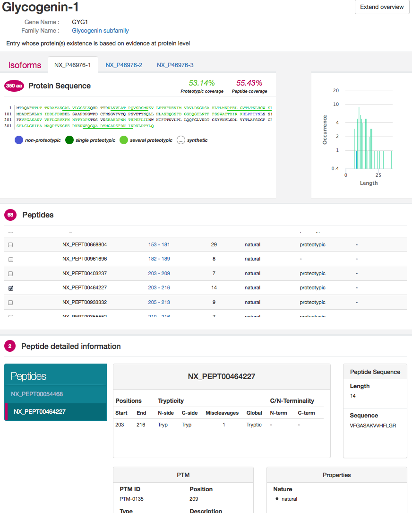

# neXtProt viewers (nextprot-viewers)
This repository groups viewers developed for [neXtProt Search](search.nextprot.org).
All this viewers could be reused

## Annotation statistics (nextprot-viewers/annot-stats)

This annotation statistic viewer shows sources of the annotations integrated into neXtProt.
A demo page of this viewer is visible here:
* https://cdn.rawgit.com/calipho-sib/nextprot-viewers/master/annot-stats/app/assets/index.html

## Peptide viewer (nextprot-viewers/peptide-viewer)

This peptide viewer shows detailed information of the peptide covering of a specific human protein.
A demo page of this viewer is visible here:
* https://cdn.rawgit.com/calipho-sib/nextprot-viewers/master/peptide-viewer/app/assets/index.html?nxentry=NX_P46976

