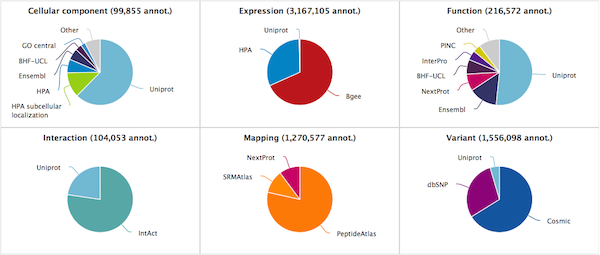

# Annotation statistic viewer (nextprot-viewers/annot-stats)

This viewer shows sources of the annotations integrated into neXtProt. It is written in javascript.  
You can see a live demo here:
* https://cdn.rawgit.com/calipho-sib/nextprot-viewers/develop/annot-stats/app/assets/index.html



This viewer is based on a provided JSON file `./app/assets/np-annot-typ-src.json`

## Installation
* Install Node dependencies
```
npm install
```
* Install Bower dependencies
```
./node_modules/.bin/bower install
```
* Later on when a dependency has changed, update Bower dependencies
```
./node_modules/.bin/bower update
```

## Usage
* Configure the project
```
./node_modules/.bin/grunt
```
* Launch the server
```
./node_modules/.bin/grunt serve
```
* Access to the viewer in the browser
http://localhost:9000/app/assets/index.html
