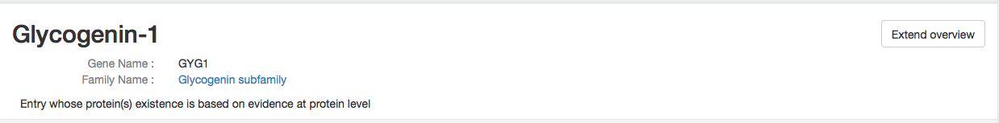
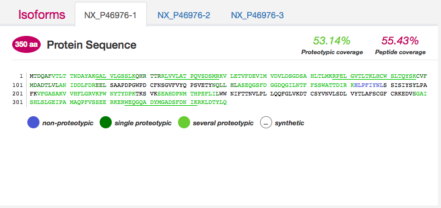
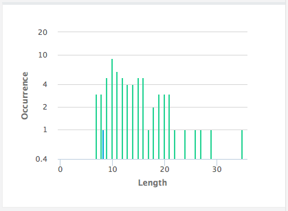
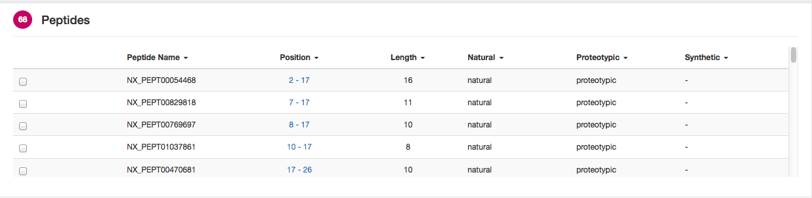
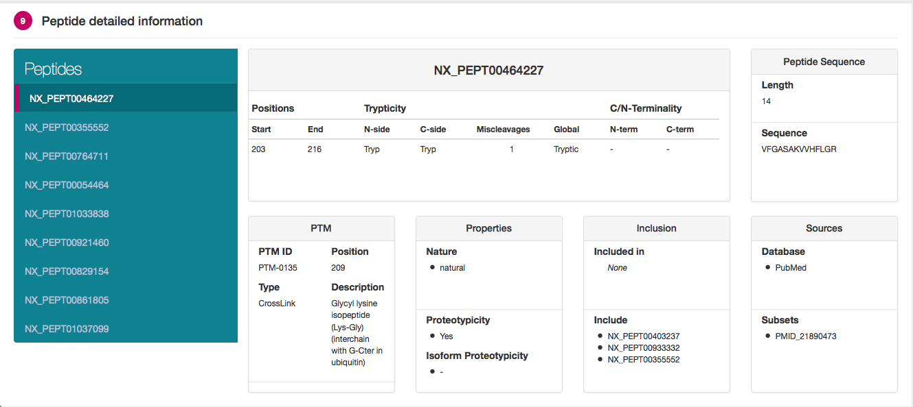

# Peptide-viewer

This peptide viewer shows detailed information of the peptides covering of a specific human protein given in the url.
To access to a specific protein, simply add "?nxentry=NX_" followed by an Uniprot ID.

You can see a live demo here :
* https://cdn.rawgit.com/calipho-sib/nextprot-viewers/master/peptides/app/index.html?nxentry=P46976

This viewer is based on the neXtProt API (https://api.nextprot.org), which can be access through the javascript library nextprot-js (see https://github.com/calipho-sib/nextprot-js).
Take a look to create your own application with the human protein data from neXtProt !

##Overview

The header shows a simple description about the protein.
A button on the right top allow to toggle between condensed infos and more detailed infos.



##Sequence

This sequence viewer has been made through another neXtProt javascript library (https://github.com/calipho-sib/sequence-viewer).
It allows a better visualization of the AA sequence, fasta-like, with the specific peptide coverage.
On the top-right are displayed the proteotypic peptide coverage and the global peptide coverage.
Finally, with the navbar at the top you can switch between isoforms, which will refresh the sequence and the others blocks.



##Histogram

This graphic represent the length distribution of the different peptides along the sequence, with the green bar for proteotypic peptide and blue for non-proteotypic.



##Peptide Table

Listing all the peptides covering the protein and some of their properties, this table can be sort by peptide property.
A click on a peptide position will highlight the specific part of the sequence, and in case of a long sequence, will automatically scroll to the highlighted substring if needed.
The checkbox on the left side will display a new block at the bottom of the table with detailed infos about the peptide selected.
Several peptides can be selected.



##Detailed Peptide

The menu on the left side allows to switch between the peptides, previously selected in the peptide table.
The right side shows a complete description of the selected peptide.  
In case of a non-proteotypic peptide, the "Properties" block will display the other entries where it can be found.





#Development

##Installation

* Download the project

2. make sure you have Node installed (v.10 +)

* Install dependencies :
```
npm install
```

```
./node_modules/.bin/bower install
```

##Usage

This project can be used with grunt.

* To be able to see live modification of your new code on your browser (http://localhost:9000/app/assets/index.html) :
```
./node_modules/.bin/grunt serve
```

* To create a bundle (dependencies.js) :
```
./node_modules/.bin/grunt
```

* Or to merge different templates with HandleBars into a js file :
(auto with grunt serve running)
```
./bower_components/.bin/grunt hbs
```

